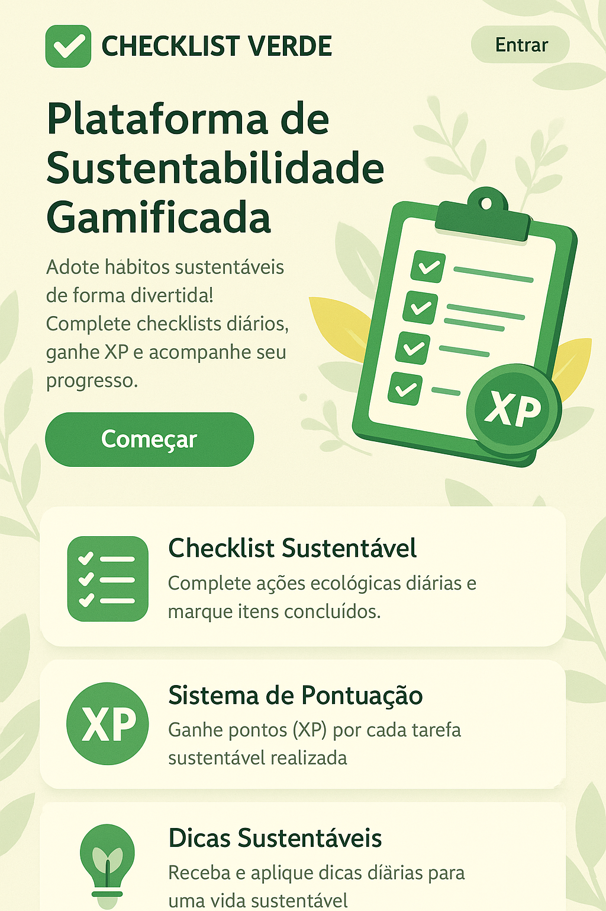
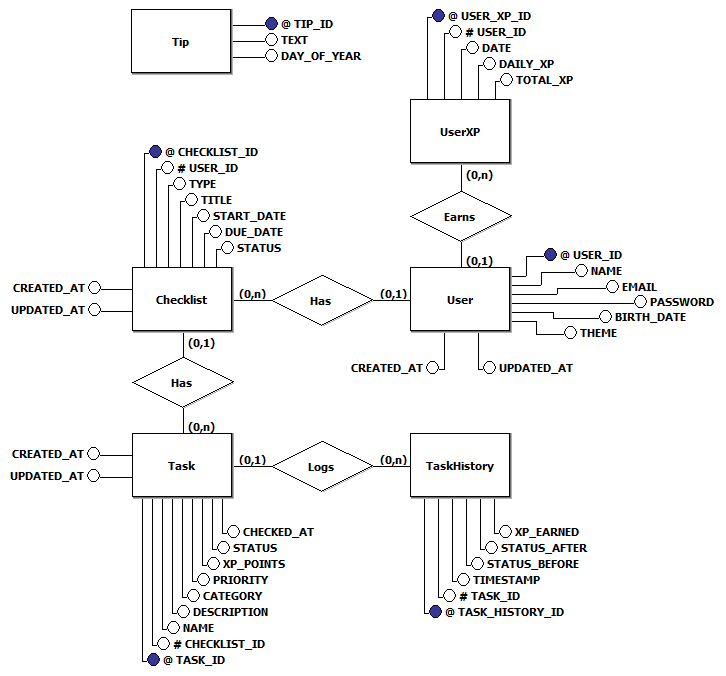

<h1 align="center">🌱 Checklist Verde</h1>

<p align="center">
  Plataforma gamificada que incentiva hábitos sustentáveis de forma divertida e acessível.
</p>

<p align="center">
  
  
  
</p>

---
<br>

<h2 align="center"> 🖼️ Preview </h2>

<p align="center">
  
</p>

---
<br>

## 🚀 Funcionalidades

- ✅ **Checklists diários** com ações sustentáveis
- 🎯 **Sistema de pontuação (XP)** por tarefas concluídas
- 🌿 **Dicas diárias** de sustentabilidade
- 🧩 **Interface acessível**, amigável e responsiva
- 🧠 Histórico de ações sustentáveis *(em breve)*

---
<br>

## 🛠️ Tecnologias

**Frontend:**  
  
  


**Backend (planejado):**  
Node.js • Express • SQLite / PostgreSQL

---
<br>

## 🛢️ Banco de Dados

A estrutura do banco de dados do projeto **Checklist Verde** é composta por várias tabelas inter-relacionadas, com o objetivo de armazenar informações sobre os usuários, checklists, tarefas, dicas, e histórico de XP. O sistema utiliza um banco de dados relacional, compatível com MySQL e SQL Server.

<h3 align="center">🗄️ MER – Modelo Entidade Relacionamento</h3>

<p align="center">
  
</p>

<h3 align="center">🎯 Estrutura do Banco de Dados
</h3>

Database: SustainabilityApp

```sql

```

---
<br>

## 📁 Estrutura de Pastas

```bash
checklist-verde/
├── backend/                # API e lógica do servidor
│   ├── config/             # Configurações
│   ├── controllers/        # Controladores das rotas
│   ├── routes/             # Rotas da API
│   ├── services/           # Regras de negócio
│   └── models/             # Modelos do banco
├── database/               # Estrutura do banco
│   ├── diagram/            # Diagramas
│   ├── migrations/         # Criação de tabelas
│   └── seeds/              # Dados iniciais
├── frontend/               # Interface do usuário
│   ├── index.html          # Página inicial
│   ├── assets/             # Recursos visuais do projeto
│   │   ├── fonts/          # Fontes
│   │   ├── icons/          # Ícones
│   │   └── images/         # Imagens
│   ├── pages/              # Páginas internas
│   │   ├── login.html      # Login
│   │   ├── signup.html     # Cadastro
│   │   ├── dashboard.html  # Painel
│   │   ├── checklists.html # Checklists
│   │   └── settings.html   # Configurações
│   ├── styles/             # CSS
│   │   ├── app.css         # Inicializador de estilos
│   │   ├── global.css      # Estilo global
│   │   ├── utils.css       # Utilitários
│   │   ├── welcome.css     # Tela inicial
│   │   ├── login.css       # Login
│   │   ├── signup.css      # Cadastro
│   │   ├── dashboard.css   # Painel
│   │   ├── checklists.css  # Checklists
│   │   └── settings.css    # Configurações
│   └── scripts/            # JS
│       ├── app.js          # Inicializador de scripts
│       ├── utils.js        # Funções
│       ├── welcome.js      # Tela inicial
│       ├── login.js        # Login
│       ├── signup.js       # Cadastro
│       ├── dashboard.js    # Painel
│       ├── checklists.js   # Checklists
│       └── settings.js     # Configurações
├── LICENSE.md              # Licença
├── README.md               # Documentação
└── .gitignore              # Ignorados pelo Git
```

---
<br>

## 🌐 Acesse o Projeto Online

O projeto está publicado via GitHub Pages e pode ser acessado aqui:

🔗 https://brenondev.github.io/checklist-verde/ 👁️

📌 Atenção: O projeto utiliza apenas front-end estático no GitHub Pages. Para funcionalidades dinâmicas com backend e banco de dados, será necessário executar o backend localmente (Node.js + banco relacional).

---
<br>

## ▶️ Como Executar Localmente

1. Clone o repositório:

   ```bash
   git clone https://github.com/brenondev/checklist-verde.git
   cd checklist-verde
   ```

2. Abra o arquivo index.html localizado na pasta frontend/ com seu navegador, ou utilize uma extensão de servidor local como Live Server (VSCode).

---
<br>

## 📚 Projeto Acadêmico

Desenvolvido para a disciplina de **UPX – Usina de Projetos Experimentais II**

Curso: **Análise e Desenvolvimento de Sistemas**

Instituição: **Centro Universitário Facens - Sorocaba-SP**

---
<br>

## 👨‍💻 Equipe

- Brenon Olivetti Rondello
- Jessica Alessandra Camargo Estevão
- Lucas Gabriel Leonel Silva
- Luiz Fernando de Souza Campos

---
<br>

## 📈 Futuras Implementações

🔐 Login com autenticação real (JWT)

📱 Versão mobile com React Native

🧠 Rank de usuários e conquistas sustentáveis

🌎 Integração com API de clima

---
<br>

## 📄 Licença

Este projeto é distribuído sob a **Licença Creative Commons Atribuição - Não Comercial - Compartilha Igual 4.0 Internacional (CC BY-NC-SA 4.0)**.

- **Atribuição (BY)**: Você deve dar crédito ao autor original de forma apropriada, fornecer um link para a licença e indicar se houve alterações.
- **Não Comercial (NC)**: Você não pode usar o material para fins comerciais.
- **Compartilha Igual (SA)**: Se você modificar ou construir sobre o material, deve distribuir suas contribuições sob a mesma licença.

Sinta-se livre para usar, modificar e compartilhar, desde que respeite as condições acima. 💚


---
<br>

<p align="center">🌍<i> Um pequeno passo diário para a sustentabilidade — gamificado. </i>🎮</p>